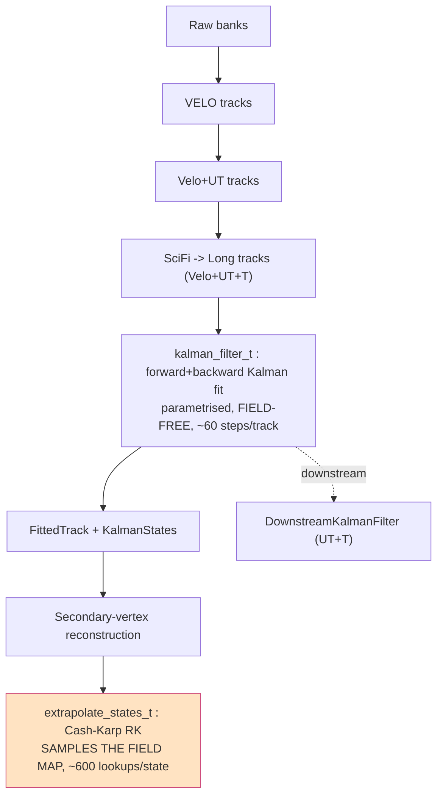
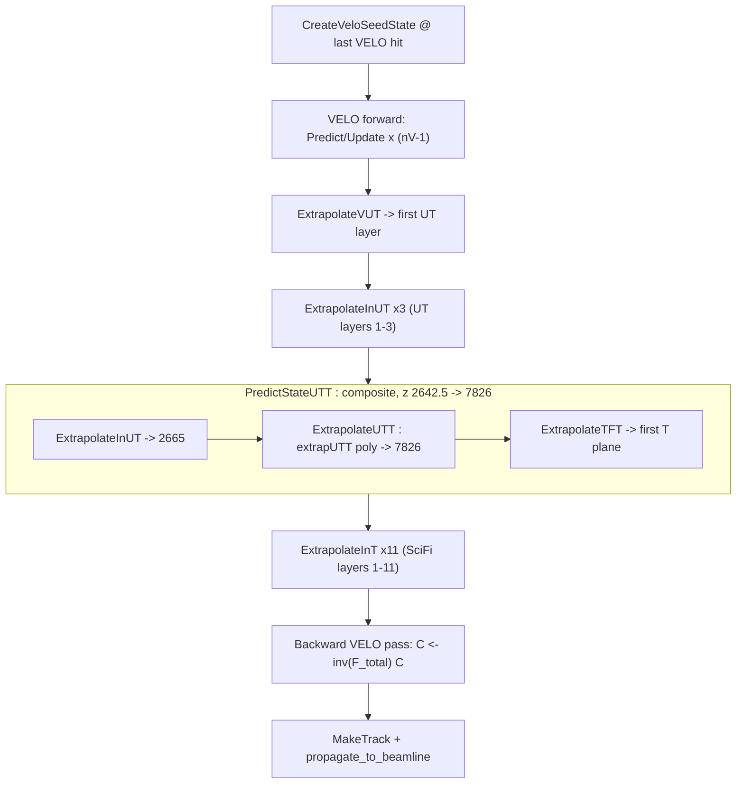
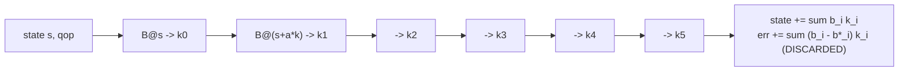
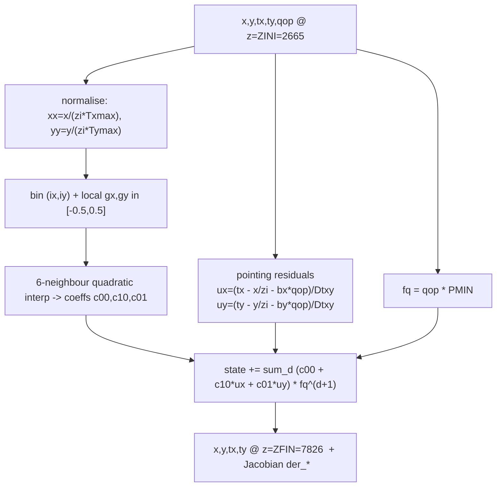
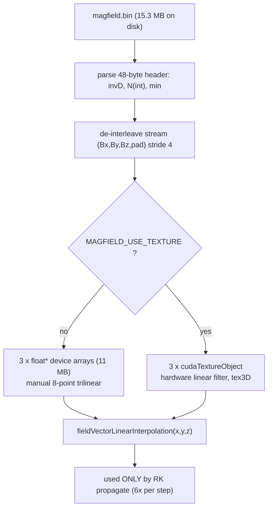

# Allen Track Extrapolation — scoping working folder

Companion artifacts for the Notion reference chapter
**Allen Track Extrapolation — Reference Chapter (2026-06, illustrated)**
<https://app.notion.com/p/3815d544b9d981188488dda13d9b9d4b>

Everything here was produced READ-ONLY from `/data/bfys/gscriven/Allen` and
`/data/bfys/gscriven/TE_stack` (nothing in those trees was modified).

## Files

| file | what it is |
|---|---|
| `field_and_trajectories.py` | reads `magfield.bin`, makes the figures, and is a clean **fp64 RK4 reference integrator** (the recommended truth generator) |
| `numbers.txt` | key scalars (peak field, ∫B·dl, pT kick, deflections) as JSON |
| `fig6_detector_schematic.png` | **detector along z + which Allen stage lives where** (VELO/UT/magnet/SciFi boxes, By profile, one labelled bracket per stage) |
| `fig1_By_axis.png` | By(0,0,z) dipole profile over the full grid, detector regions shaded |
| `fig2_By_xz_slice.png` | By(x, y=0, z) heat map — the bending component in the x–z plane |
| `fig3_B_components.png` | Bx, By, Bz on axis (Bx,Bz≈0; By dominates) |
| `fig4_trajectories.png` | fp64 RK4 tracks for p = 3,5,10,20,50 GeV from UT exit through the magnet |
| `fig5_kick_integral.png` | tx(z) and cumulative bending power for p = 10 GeV |

Regenerate everything: `python3 field_and_trajectories.py`

## Key numbers (numbers.txt)

- field grid `81 × 81 × 146`, isotropic `100 mm`, min `(-4000,-4000,-500)` mm
- peak `By = -1.048 T @ z = 4700 mm` (MagDown, By<0); units are Gaudi (`tesla = 1e-3`)
- `∫By·dl` over UT→T (z 2665→7826) `= -3.733 T·m`  ⇒  `pT kick = 0.299792458·|∫B·dl| = 1.12 GeV`
- deflection scales as `Δx ∝ tx_out ≈ pT_kick / p` (e.g. 10 GeV → Δx≈484 mm, tx≈0.121)

## Conventions (locked)

- `kappa = 1e-3 · qop`, `qop = 0.299792458 · q/p[1/GeV]` (= Allen `c·q/p`)
- field = LHCb FieldMap **v8r1 down**, raw MagDown `By < 0`, no sign flips
- `extrapUTT` pairs with `m_polarity = -1`

## Mermaid diagram sources (also embedded in the Notion page)

### 1 — Where extrapolation sits in HLT1

### 2 — Per-track Kalman fit sequence

### 3 — Cash–Karp RK step

### 4 — extrapUTT dataflow

### 5 — Field map load + lookup

